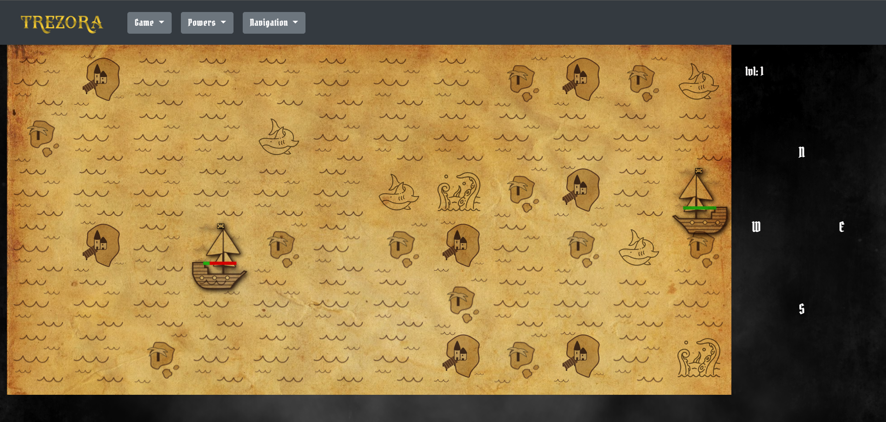

# Find the treasure !

Greetings, fellow sailor !

Do you hear the call of adventure ?
Do you feel yourself the soul of a true pirate ?

If so, I heard that a treasure waits since a long time to be found...

But it won't be easy to find, huge is the sea, and so are the perils.

Go ahead and make your attempt, sail across the sea and find the treasure before your opponent !

## How it works
1. When the game start, an hint helps you to determine on which type of tile the treasure is hidden.
2. Move the boat by clicking on the cardinal direction letters
3. At each move, your opponent does the same. It also knows on which type of tile the treasure is hidden on and wants it as much as you.
4. If you find the treasure, you win the game and gain Xp. Gaining xp makes you reach levels.
5. The soul of ancient pirates (and the developper) helped you by giving special powers to find the treasure before your opponent. After a few games, you will unlock the first one in the shop. They are for sale and are disposable so use them carefully.
6. If your opponent find the treasure, you lose the game but also gain xp and gold, but less.
7. When the game is over, another starts immediately to keep on having fun.
8. For fellow developpers, a glimpse in your navigator console may reveal some interesting information.. ;)

## How it is build
- Plain Javascript
- Html 5
- CSS 3

## How it looks like

## Warning

The purpose of this game is not to be developped further, just to train javascript, html and css in a funny way.
However, I'm fully open to any suggestion or improvement idea.

Hope you will enjoy it :) 
[here is the link of the github page](https://tolexia.github.io/trezora/) 